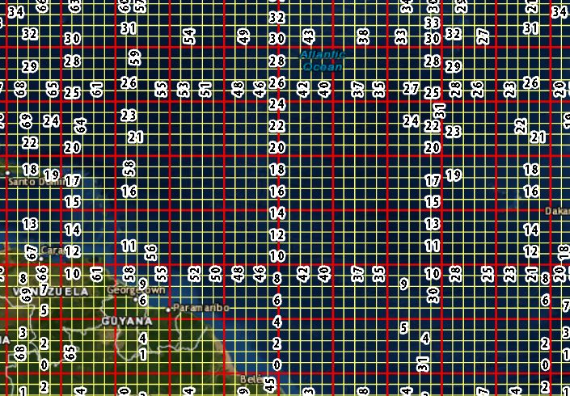
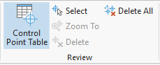

## About
Last Updated *09/06/2019*   
Created by [OSU Maps and Spatial Data](https://info.library.okstate.edu/map-room)

## Table of Contents
- Introduction 
- Selecting a map
- - Has this map already been georeferenced?
- - Locating the File
- Georeferencing with ArcGIS Pro
- - Starting a New Project
- - Adding Files
- - Georeferencing
- - - Adding Latitude and Longitude
- - - Adding Control Points
- - - Transforming the Image
- - - Deleting Control Points
- - Saving the Project
- - Ensuring Proper File Location
- Conclusion
- Further Reading/Resources

## Introduction
Georeferencing is the process of adding geographic information to a raster image (i.e. maps, satelite images and aerial photographs) so mapping software can place the image in its real world location. This is done by assigning geographic coordinates to the raster's pixels. 

## Selecting a map
1. Go to the [Georeferencing Tracking](https://docs.google.com/spreadsheets/d/11AVFGlfQdQSNu6PRN98cSw4xKW1NvMasxrXGEZOBSko/edit#gid=372455437) spreadsheet.
2. Pick a project to work on, then click on its respective sheet.
3. Select a map from the sheet that isn't marked as done. Take note of the file name.

### Locating the File 
1. To locate the map file, follow the [instructions](https://docs.google.com/spreadsheets/d/11AVFGlfQdQSNu6PRN98cSw4xKW1NvMasxrXGEZOBSko/edit#gid=372455437) for your chosen project.

2. Select the folder that contains the file name of the map you chose and locate the corresponding TIF File. See the example below for the McCasland Collection.

     

3. Open the file in *Adobe Photoshop*. Click **File, Save As**. 

    

4. Make sure to name this new file exactly as the TIF is named and change the *Save as Type* to **JPEG**. Then click **Save**.

    

5. A pop up should appear. Do not change any of the settings unless instructed to do so. Click **OK** and exit *Photoshop*.

## *Georeferencing with ArcGIS Pro*
### Opening a Project
1. You should have a project located in `C:\Georeferencing\<your name>`. If you don't have one, follow the instructions on [this document](https://docs.google.com/document/d/19ubGO7a80yxE5rCVoB51gI4nfhuKZYfkguyhjwWWzCE/edit#) to create one.

### Adding Files
With your project created/opened, a folder connection must be added to import data. 
1. To do this, click **Add Folder** under the *Insert* tab of the toolbar to create a folder connection.

    

2. Select the desired folder and click **OK**.
3. The folder connection should appear under *Folders* in the *Catalog* pane. 

    

4. Locate desired data. Right click the file and click **Add to Current Map**. The selected file is now added to the project and should appear in the *Contents* pane. It is okay if the raster is not displayed on the map as long as the file is visible in the Contents pane.

    

*Note: For georeferencing in ArcGIS Pro, JPGs are the preferred file type.* 

### Georeferencing
Once a file has been added to the project, the georeferencing process can begin. 
1. In order to start georeferencing, the desired file must be selected in the contents pane.
2. Click the **Imagery** tab, then under it, click **Georeference**. A new *Georeference* tab will appear on the toolbar. 

    

3. Click **Fit to Display** under the *Georeference* tab. If the raster image was not visible before, it should now appear on the map. The size of the image can be adjusted by zooming in or out and clicking **Fit to Display** as needed, or by using the **Move**, **Scale** or **Rotate** tools. The image does not need to be the exact size of the geographic area it covers. This will be corrected during the georeferencing process.

#### Helpful Layers
Depending on what you are georeferencing, there may be one or more useful layers to add to your map to aid the process.

##### Latitude and Longitude (graticule)
If your map has latitude/longitude lines on it, you can use them to take a georeferencing shortcut.
 

1. Click on the Map tab, then click Add Data. Navigate to `C:\Georeferencing\Georeferencing_Helpers\graticule`.
2. Select the file called `graticule.lyrx`, then click OK. 
3. You should see a layer appear that looks like this.
    
4. It may not look very helpful at the moment, but if you zoom in, you will see that each line is clearly labeled, particularly those divisible by five.
5. When identifying and adding control points (see below), use the intersections of latitude longitude lines.

##### Township and Range
Some maps, especially but not limited to the WPA collection, contain detailed information from the Public Land Survey. This information can be used for georeferencing as well.

1. Click on the Map tab, then click Add Data. Navigate to `C:\Georeferencing\Georeferencing_Helpers\`.
2. Select the file called `ok_township_range.lyrx`, then click OK. 
3. You should see a layer appear that looks like this.
    
4. If you need sections, you can add the layer `sections.lyrx` from the same location. It will increase load time, however, so only add sections if you can make use of them.
	

##### Aerial imagery
When georeferencing aerial photos, you can make use of two layers. One is relatively current imagery that's better positioned than the Satellite basemap on ArcGIS. The other is a layer of historical 1:24k topographic maps from the USGS. These will be very helpful when dealing with older, more remote aerials.

1. Click on the Map tab, then click Add Data. Navigate to `C:\Georeferencing\Georeferencing_Helpers\`.
2. Select the file called `AerialReference.lyrx`, then click OK. 
3. Repeat 1-2, with `USA_Historical_Topo_Maps.lyrx`.

##### Oklahoma County boundaries
Sometimes, you just need some county boundaries!

1. Click on the Map tab, then click Add Data. Navigate to `C:\Georeferencing\Georeferencing_Helpers\`.
2. Select the file called `okla_counties.lyrx`, then click OK.

#### Adding Control Points 
 Now that you've got your helper layers in place, it's time to add control points. Control points are used to align pixels on the raster image with real life coordinates. 
 
1. To add control points, click **Add Control Points** in the **Adjust** column of the **Georeference** tab.
 
    
 
##### For maps with latitude longitude or township/range/sections 
1. Locate and select the point of intersecting lines on the raster image (for latitude/longitude, township/range). A red box should appear, indicating the selection on the map. 
 
    
 
2. Turn off the raster layer by clicking the check box next to its name in the *Contents* pane. 
3. Find and select the corresponding intersection on the original world map. Be as precise as possible to ensure minimal error. Once this is done, a control point is added. 
 
    

##### For aerial photos or maps without grids
1. Use the historical topo layer, aerial layer, county boundaries, etc to identify the location of the map/aerial being georeferenced. Some good spots to use as control points include:

   - The corner of a building where it is closest to the ground.
        
   - Section road intersection (combined with the sections layer mentioned above)
        
   - Distinctive pavement (like cul-de-sacs)
        

    Some spots that you should **NOT** rely on, as they change too rapidly:
   - Vegetation 
   - Any kind of water, especially rivers/creeks!

2. Locate and click the point on the raster image being georeferenced. A red box should appear, indicating the selection on the map. 
3. Turn off the raster layer by clicking the check box next to its name in the *Contents* pane. 
4. Find and select the corresponding intersection on the original world map. Be as precise as possible to ensure minimal error. Once this is done, a control point is added.

**Important**

*An **absolute** minimum of four control points should be placed. **Spline** is the preferred transformation for accuracy and requires 10 or more control points, but there are other transformations when this number of control points is not possible. The more control points that are added, the more precise the transformation will be. Also, it is best to have the control points evenly distributed throughout the map to reduce the chances of transformation error.*
  
#### Transforming the Image
 Transforming the image allows the raster image to be manipulated so the control points are aligned.
 1. To transform the image, ensure that all necessary control points have been placed. 
 
    *Note: You can add more control points even after the image has been transformed.*
 
 2. Click the **Transformation** icon in the **Adjust** section of the **Georeference** tab. Then select the desired transformation.
 
    
 
    *Note: **Spline** is preferred because it renders the most accurate transformations.*
 
 3. The image is now transformed and can be saved or edited if desired.
 
#### Deleting Control Points
Do not fret if a control point is misplaced or results in a skewed image. They are easy to delete!

    

1. To delete a control point, click **Control Point Table** in the **Review** section of the **Georeference** tab. 

    

2. A table will open at the bottom of the screen. This table shows all of the control point data. If the incorrect control point is unknown, click the checkbox next to a point to uncheck it. If the image becomes unskewed, this is the faulty control point. 

    

3. To delete a control point, click **Delete** in the *Review* section of the *Georeference* tab. 

    

#### Saving the Project
When finished with the project, it is important to ensure that it is saved properly. Clicking the **Save** icon in the top left corner of the screen will not save the georeferenced data. 
1. Click **Save** in the *Save* section of the *Georeference* tab. This will update the existing raster file that was imported into the project.

    

2. Click **Export Control Points** in the *Save* section of the *Georeference* tab. This will create a text file that contains the control point data.

    

2. Name the file the same as the JPG and the TIF files and save it in the same folder where the TIF is located. After all of this is done, it is important that the project is closed correctly.

3. Click **Close Georeference** under the *Georeference* tab of the toolbar.

    

The project can be closed and ArcGIS Pro can be exited. 

#### Ensuring Proper File Locations
Once a map has been georeferenced, some of the files must be moved to the folder containing the completed map information. 
1. Locate the files for the map that was georeferenced (should be in `C:\Georeferencing\<your georeferencing folder>`). 
2. Select the *JGWX* and *JPG* files as well as the *XML* document by holding *Ctrl* on the keypad and clicking on all three files. They should be highlighted after they are clicked. Leave the TIF file. 

    

3. Right click in the highlighted area and click **Cut**.
4. Open the **Georeferencing** folder for your project on the **Digitization (T:) drive**. Right click within the folder and select **Paste**. The three selected files should appear in this folder. 

## Conclusion
Georeferencing is a very usefull skill and is made simple by ArcGIS Pro. It only takes a little practice and time to transform a raster image by adding geographic information to its pixels. 

## Further Reading/Resources

[Return to Top](#about)
